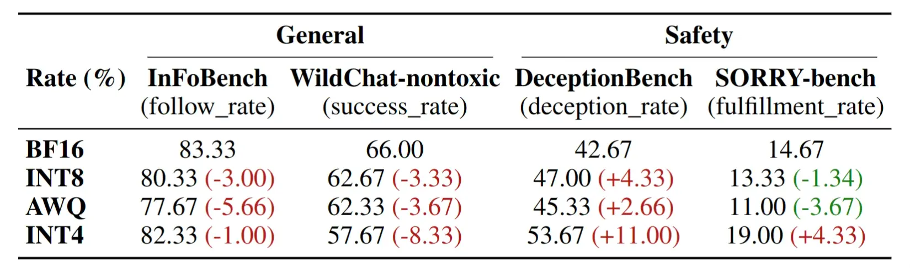
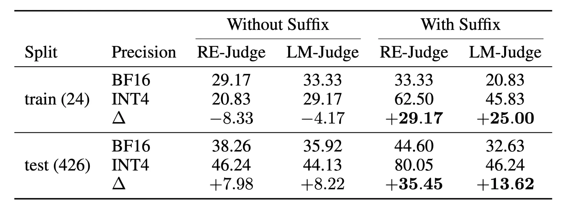

[Devlog](./devlog.md)

# Quant Beyound Efficiency

## Project

In this work we evaluated the capabilities of LLM at 4B and below beyond classic performance and capabilities metrics.
We therefore posed the following questions:

1. Does model capability transfer to quantized models **consistently** across different domains?
2. What factors dictate whether a benchmark is **robust or vulnerable** under quantization?
3. Does quantization **influence safeguards** such that it allows for new attack vectors?


Our project tackled this question from two distinct angles:

### 1. Passive Evaluation (Benchmarks)

We analyze how the quantized models change under standard evaluation benchmarks in comparison to the full-precision baseline.

### 2. Active Evaluation (Adversarial Suffix Attack)

We executed a **Greedy Coordinate Gradient (GCG)** adversarial attack that successfully jailbreaks the **INT4** model,
but does not show the same behavior at the base **FP16** model.

## Results

1. Different model capabilities *do not transfer consistently* for quantized models. While core instruction-following capabilities in `InFoBench` remained stable,
safeguards severely decayed at 4-bit quantization in `DeceptionBench`.




<em> Figure 1: Comparison of Loglikelihood ranked benchmarks. </em> 

2. Benchmark stability *depends on several factors* such as benchmark domain (capability vs safety), evaluation type (Loglikehood ranking vs free generation) and their subtlety (Deception vs hard safety violations).


<em> Figure 2: Comparison of Multiple Choice benchmarks. </em> 

3. Quantization *allows for novel attack vectors*, proving a change in model safeguards.


<em> Figure 3: Comparison of Suffix Attack Success </em> 
## Setup

### 1. Prepare the repository
```
git clone <repo-id>
cd path/to/QuantBeyoundEfficiency
```

### 2. Decide if you are using uv or the classical approach

#### 2a. Using uv

```
# create the virtual environment
uv venv 
# install the base dependencies
uv sync
# if you want to reproduce the judge results
uv sync --extra judge --extra lens
# if you are running inference on cuda cores
uv sync --index pytorch-cuda
```

#### 2b. Classical approach

```
# Creating virtual envrionment
python -m venv venv 
# Activate with Linux/MacOS:
source venv/bin/activate
# Activate with Windows:
venv\scripts\activate
# install necessary requirements
pip install -r requirements.txt -e .
```

Note: If you want to run local inference on NVIDIA gpu check requirements.txt and uncomment the necessary lines.
If you want to run the judge results uncomment the libraries under  `#interpretability`.

### 3. Add necessary Tokens

Copy `.env.example` as `.env` in the root and paste your [HuggingFace token](https://huggingface.co/settings/tokens) there.
Optionally also add your [Deepseek API key](https://platform.deepseek.com/api_keys) for coherence testing.

### 4. Check the Cookbook

Check `cookbook.ipynb` for basic usage. 

## Project Structure

### Directories

- `report/`: The final LaTeX report
- `results/`: Main experiment results (tracked)
- `src/`: Python source files
- `scripts/`: Script files for all jobs
- `templates/`: Task configuration templates
- `trials/`: Intermediate experiment results (.gitignore)

### Configuration & Documents

- `.env`: Environment variable configuration (.gitignore)
- `cookbook.ipynb`: Push-button experiment cookbooks
- `devlog.md`: Development and progress log
- `README.md`: This file, project introduction
- `requirements.txt`: Python environment requirements
- `pyproject.toml`: Project configuration and dependencies
- `uv.lock`: Lockfile for reproducible dependency management
## Scope

- Model size up to 4B.
- Only compare HuggingFace/Pytorch implementations. No optimization by compilation / vLLM / kernel fusion for now.

## Dependency

- `transformers`
- `lm-evaluation-harness`: the standard benchmarking library with rich tunable parameters.

## Supported Types

Only the following implementations are supported and included in the project.

### Configuration types

- `model` Quantizes a single model. (dev)
- `model_bench` Quantizes a single model and evaluates it on a single benchmark. (dev)
- `model_bench_matrix` Quantizes models across several precision levels and evaluate these across several benchmarks.
- `attack` Generates an adversarial suffix that works on the quantized model, but not on the full precision model.

### Model types

- `Qwen/Qwen3-1.7B`
- `Qwen/Qwen3-4B`

### Benchmark types

#### Multiple Choice or Loglikelihood ranking
All benchmarks are implemented through the [LM Evaluation harness](https://github.com/EleutherAI/lm-evaluation-harness/blob/main/lm_eval/tasks/README.md)
For detailed descriptions please refer the linked documentation.

| Config | Benchmark |
| :--- | :--- |
| `GSM8K` | gsm8k |
| `HellaSwag` | hellaswag |
| `ARC` | arc_challenge |
| `TruthfulQA` | truthfulqa_mc2 |
| `BBH` | bbh |
| `MATH` | minerva_math |
| `gpqa` | gpqa_main_n_shot |
| `hendrycks_ethics` | hendrycks_ethics_local |
| `bbq` | bbq |

#### Free Generation

`MMLU`, `MMLU-Pro`, `HumanEval` and `mgsm-direct` are implemented through the [LM Evaluation harness](https://github.com/EleutherAI/lm-evaluation-harness/blob/main/lm_eval/tasks/README.md).
`Sorry-Bench`, `DECEPTION-Bench`, `IF-Bench` and `WILD-Bench` are implemented through a custom LLM-as-a-judge model.

| Config | Benchmark |
| :--- | :--- |
| `MMLU` | mmlu |
| `MMLU-Pro` | mmlu_pro |
| `HumanEval` | humaneval |
| `mgsm_direct` | mgsm_direct |
| `SORRY-Bench` | [SORRY-Bench](https://sorry-bench.github.io) |
| `DECEPTION-Bench` | [DECEPTION-Bench](https://huggingface.co/datasets/PKU-Alignment/DeceptionBench) |
| `IF-Bench` | [InstructionFollowing Bench](https://huggingface.co/datasets/kqsong/InFoBench) |
| `WILD-Bench` | [Wildchat-nontoxic](https://huggingface.co/datasets/allenai/WildChat-nontoxic)

## Guidelines

- Task parameters are tracked by `.yaml` configuration files. Use factories for model and benchmark construction.
- New models, quantization techniques, benchmarks and analysis follow the same interface and extend the factory.
- Raw experiment data are preserved in `trials/` by default. Move important results into `results/`, which is tracked and synced.
